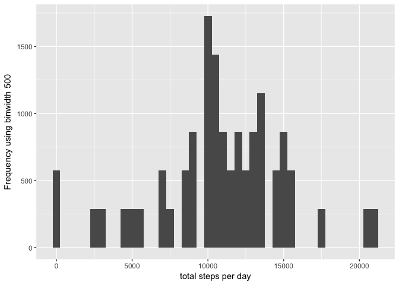
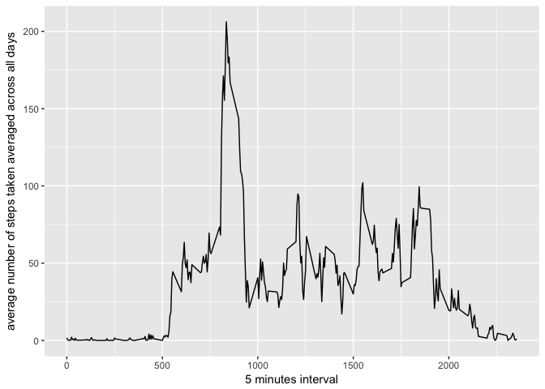
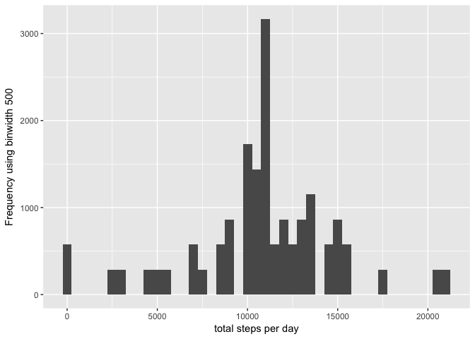
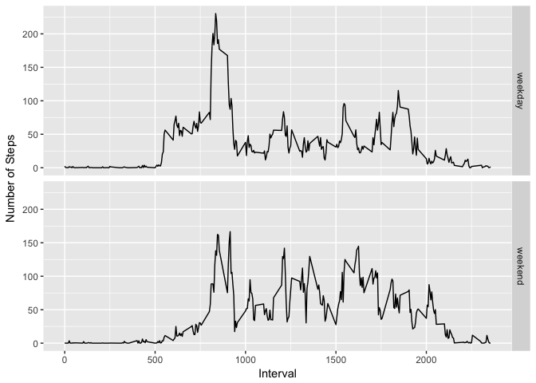

# Reproducible Research: Peer Assessment 1
Fabricio Dujardin  
7/29/2017  


### Loading and preprocessing the data


```r
library(data.table)
#load data
data <- data.table(read.csv("activity.csv"))
library(lubridate)
#Process/transform the data (if necessary) into a format suitable for your analysis
data[,date:= ymd(date)]
#omit na in steps column
data1<- data
data <- na.omit(data, cols="steps")[]
```

##What is mean total number of steps taken per day?


```r
names(data)
```

```
## [1] "steps"    "date"     "interval"
```

```r
stepday<- data[,V1:= sum(steps,na.rm=T), by=date]#date repeats, so it is used as a factor
stepday #Calculate the total number of steps taken per day
library(ggplot2)
#qplot(stepday[,V1], binwidth = 500, xlab= "total steps per day", ylab = "Frequency using binwidth 500")
g <- ggplot(stepday, aes(V1)) 
g <- g + geom_histogram(binwidth = 500)
g <- g + labs(x= "total steps per day", y = "Frequency using binwidth 500")#Make a histogram of the total number of steps taken each day

#Calculate and report the mean and median of the total number of steps taken per day
stepmean <- data[,mean(V1,na.rm=T)]
stepmedian <- data[,median(V1,na.rm=T)]
```
* Calculate the total number of steps taken per day

```r
stepday
```

```
##        steps       date interval   V1
##     1:     0 2012-10-02        0  126
##     2:     0 2012-10-02        5  126
##     3:     0 2012-10-02       10  126
##     4:     0 2012-10-02       15  126
##     5:     0 2012-10-02       20  126
##    ---                               
## 15260:     0 2012-11-29     2335 7047
## 15261:     0 2012-11-29     2340 7047
## 15262:     0 2012-11-29     2345 7047
## 15263:     0 2012-11-29     2350 7047
## 15264:     0 2012-11-29     2355 7047
```
* Make a histogram of the total number of steps taken each day

```r
g
```

<!-- -->
* Calculate and report the mean and median of the total number of steps taken per day

```r
stepmean
```

```
## [1] 10766.19
```

```r
stepmedian
```

```
## [1] 10765
```

#What is the average daily activity pattern?


```r
averageStepsAccrossDay <- data[,mean(steps), by=interval]
```

* Make a time series plot (i.e. 𝚝𝚢𝚙𝚎 = "𝚕") of the 5-minute interval (x-axis) and the average number of steps taken, averaged across all days (y-axis)


```r
g <- ggplot(averageStepsAccrossDay, aes(interval,V1)) + geom_line()
g + labs(x= "5 minutes interval", y= "average number of steps taken averaged across all days")
```

<!-- -->

* Which 5-minute interval, on average across all the days in the dataset, contains the maximum number of steps?

```r
averageStepsAccrossDay[order(-V1),][1,]
```

```
##    interval       V1
## 1:      835 206.1698
```

##imputing missing values

Note that there are a number of days/intervals where there are missing values (coded as 𝙽𝙰). The presence of missing days may introduce bias into some calculations or summaries of the data.

* Calculate and report the total number of missing values in the dataset (i.e. the total number of rows with 𝙽𝙰s)


```r
data1[is.na(steps),.N]
```

```
## [1] 2304
```

```r
data1[is.na(steps),.N,by=date]
```

```
##          date   N
## 1: 2012-10-01 288
## 2: 2012-10-08 288
## 3: 2012-11-01 288
## 4: 2012-11-04 288
## 5: 2012-11-09 288
## 6: 2012-11-10 288
## 7: 2012-11-14 288
## 8: 2012-11-30 288
```

Devise a strategy for filling in all of the missing values in the dataset. The strategy does not need to be sophisticated. For example, you could use the mean/median for that day, or the mean for that 5-minute interval, etc.

* Create a new dataset that is equal to the original dataset but with the missing data filled in.

```r
library(Hmisc)
newdataset <- data1[,steps1:=impute(steps,mean),by=interval]
```

*Make a histogram of the total number of steps taken each day and Calculate and report the mean and median total number of steps taken per day. Do these values differ from the estimates from the first part of the assignment? What is the impact of imputing missing data on the estimates of the total daily number of steps?


```r
stepday1<- newdataset[,V1:= sum(steps1,na.rm=T), by=date]#date repeats, so it is used as a factor
stepday1 #Calculate the total number of steps taken per day

library(ggplot2)
#qplot(stepday[,V1], binwidth = 500, xlab= "total steps per day", ylab = "Frequency using binwidth 500")
g <- ggplot(stepday1, aes(V1)) 
g <- g + geom_histogram(binwidth = 500)
g + labs(x= "total steps per day", y = "Frequency using binwidth 500")#Make a histogram of the total number of steps taken each day
```

<!-- -->

```r
#Calculate and report the mean and median of the total number of steps taken per day
stepmean1 <- newdataset[,mean(V1,na.rm=T)]
stepmedian1 <- newdataset[,median(V1,na.rm=T)]
```


```r
all <- matrix(c(stepmean1,
stepmean,
stepmedian1,
stepmedian),1,4)

all <- data.frame(all)
names(all) <- c("new data mean",
"mean",
"new data median",
"median")
library(knitr)
kable(all)
```


 new data mean       mean   new data median   median
--------------  ---------  ----------------  -------
      10766.19   10766.19          10766.19    10765


## Are there differences in activity patterns between weekdays and weekends?

* Create a new factor variable in the dataset with two levels – “weekday” and “weekend” indicating whether a given date is a weekday or weekend day.


```r
newdataset[,weekdays:= ifelse(weekdays(date) %in% c("Saturday","Sunday"),"weekend","weekday")]
```

* Make a panel plot containing a time series plot (i.e. 𝚝𝚢𝚙𝚎 = "𝚕") of the 5-minute interval (x-axis) and the average number of steps taken, averaged across all weekday days or weekend days (y-axis). See the README file in the GitHub repository to see an example of what this plot should look like using simulated data.


```r
stepsweekdaysbyinterval <- newdataset[,mean(steps1),by=c("interval","weekdays")]

g <- ggplot(stepsweekdaysbyinterval, aes(interval, V1)) + geom_line() + facet_grid(weekdays ~.) + xlab("Interval") + ylab("Number of Steps") 
g
```

<!-- -->


